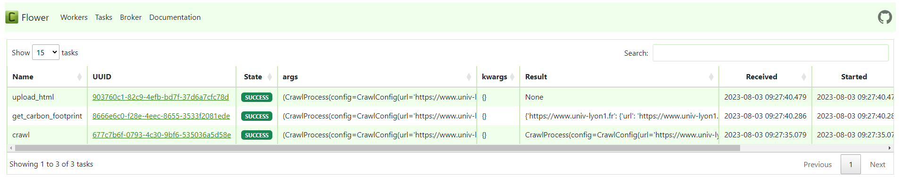
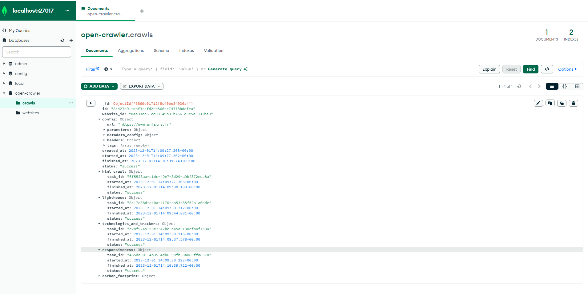
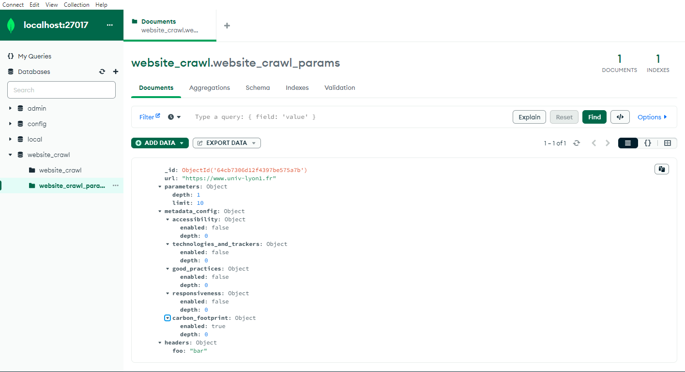
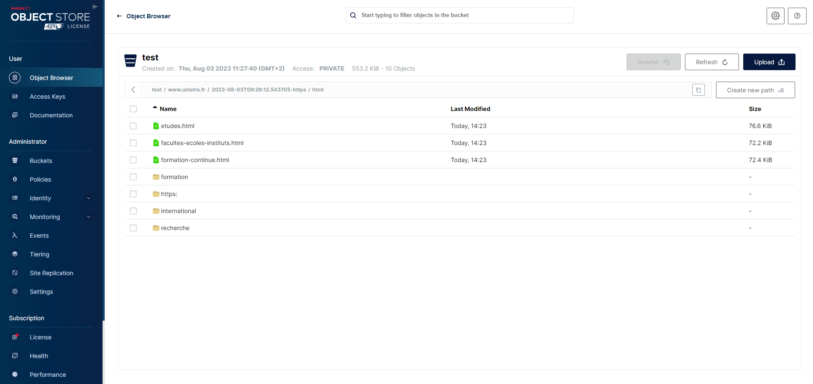

# open-crawler

This is ScanR crawler application. It is a web crawler developped in python.
## Prerequisites

Make sure you have installed :

* git
* docker-compose

## Installation

Git clone project

```bash
  git clone https://github.com/dataesr/open-crawler.git
  cd open-crawler
```
    To configure this project, you will need to change the following environment variables in your .env file

For volumes mount:

`LOCAL_FILES_PATH`

`MINIO_PATH`

`MONGODB_PATH`

For database:

`MONGO_URI`

`MONGO_DBNAME`

`MONGO_WEBSITES_COLLECTION`

`MONGO_CRAWLS_COLLECTION`

For storage service:

`STORAGE_SERVICE_USERNAME`

`STORAGE_SERVICE_PASSWORD`

`STORAGE_SERVICE_URL`

`STORAGE_SERVICE_REGION`

`STORAGE_SERVICE_BUCKET_NAME`

`HTML_FOLDER_NAME`

`METADATA_FOLDER_NAME`

For Google API KEY:

`GOOGLE_API_KEY`

For default recrawl interval (in days):

`DEFAUL_RECRAWL_INTERVAL`
## Deployment

To deploy this project run

```bash
  docker-compose up
```

## API Reference

#### Create a new website and crawl it

This endpoint allows you to create a new website configuration end execute a crawl afterwards. This will raise an error if the website url is already defined in the database 'website' collection.

```http
  POST http://127.0.0.1:8080/api/websites
```

| Parameter          | Type             | Description                                                         |
|:-------------------|:-----------------|:--------------------------------------------------------------------|
| `url`              | `string`         | **Required**. Starting url to crawl from                            |
| `depth`            | `integer`        | Maximum depth to crawl (**Default**: 2)                             |
| `limit`            | `integer`        | Maximum pages to crawl (**Default**: 400)                           |
| `use_playwright`   | `boolean`        | Activation of scrapy-playwright (**Default**: false)                |
| `headers`          | `dict[str, str]` | Headers that will be passed to all crawl requests (**Default**: {}) |
| `lighthouse`       | `MetadataConfig` | Lighthouse configuration (**Default**: {'enabled':True, 'depth' 0}) |
| `technologies`     | `MetadataConfig` | Technologies configuration (**Default**: {'enabled': False})        |
| `carbon_footprint` | `MetadataConfig` | Carbon Footprint configuration (**Default**: {'enabled': False})    |
| `tags`             | `list[str]`      | List of tags to associate to this website (**Default**: [])         |
| `crawl_every`      | `integer`        | Time to wait between each crawl (In days, >= 0, **Default**: 30)    |

**MetadataConfig**

| Parameter | Type     | Description                |
| :-------- | :------- | :------------------------- |
| `enabled` | `boolean` | Should the metadata be processed |
| `depth` | `integer` | Maximum depth for which the metadata should be processed (sets enabled to true if not present)|

***This is only what would be the main endpoint, the rest of the API reference can be found at http://127.0.0.1:8080/docs (by default)***
## Demo


*This gif might not reflect the last changes*


## Monitor crawl tasks in Celery

The docker-compose file deploys a Flower service which allows us to monitor tasks as they are beeing processed.
In order to consult it, we need to navigate to http://localhost:5555/flower (by default)




## Monitor crawl configuration and crawl process status in MongoDB 

The docker-compose file deploys a MongoDB service in which we store the crawl configuration an the crawl process status during the execution.

To access the two collections, use a MongoDB console (such as MongoDB Compass for example) and connect to http://localhost:27017 (by default)

**website_crawl** collection:


**website_crawl_parameters** collection:
## Acces simple storage service

At the end of the crawl process, all crawled html pages are uploaded to a simple storage service (s3).
The metadata are directly uploaded to the storage service.

The docker-compose file deploys a MinIO service that can be accessed at http://localhost:9090. (by default)

