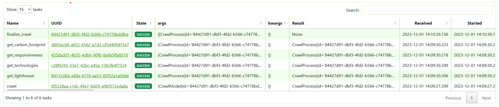
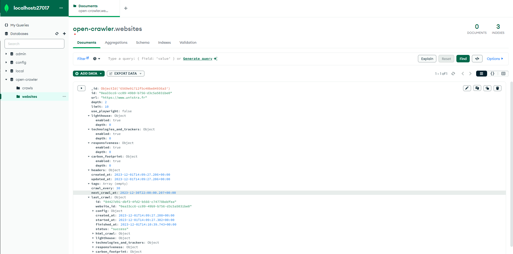
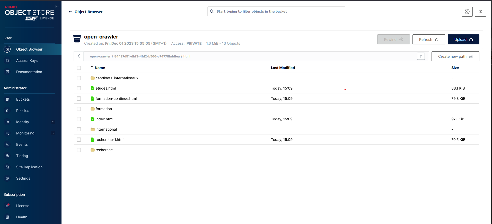

# open-crawler

This is ScanR crawler application. It is a web crawler developped in python.
## Prerequisites

Make sure you have installed :

* git
* docker-compose

A Google Cloud API KEY is requested in order for the responsiveness metadata to work properly:
https://developers.google.com/webmaster-tools/search-console-api/v1/configure?hl=fr

Once you created the API KEY, you need to store its value in `GOOGLE_API_KEY` in the .env file.

You also need to activate Google Search Console API: https://console.cloud.google.com/apis/dashboard

## Installation

Git clone project

```bash
  git clone https://github.com/dataesr/open-crawler.git
  cd open-crawler
```
    
## Environment Variables

To configure this project, you will need to change the following environment variables in your .env file

For RabbitMQ :

`RABBITMQ_USERNAME`

`RABBITMQ_PASSWORD`

For volumes mount:

`LOCAL_FILES_PATH`

`MINIO_PATH`

`MONGODB_PATH`

For storage service:

`HTML_FOLDER_NAME`

`METADATA_FOLDER_NAME`

For Google API KEY:

`GOOGLE_API_KEY`

## Deployment

To deploy this project run

```bash
  docker-compose up
```


## API Reference

#### Start a new crawl

```http
  POST http://127.0.0.1:8080/crawl
```

| Parameter | Type     | Description                |
| :-------- | :------- | :------------------------- |
| `url` | `string` | **Required**. Starting url to crawl from |
| `depth` | `integer` | Maximum depth to crawl (**Default**: 2) |
| `limit` | `integer` | Maximum pages to crawl (**Default**: 50) |
| `headers` | `dict[str, str]` | Headers that will be passed to all crawl requests |
| `metadata` | `list[MetadataConfig]` | Metadata config overload |

**MetadataConfig**

| Parameter | Type     | Description                |
| :-------- | :------- | :------------------------- |
| `name` | `str` | Name of the metadata (accessibility, good_practices, technologies, responsiveness, carbon_footprint) |
| `enabled` | `boolean` | Should the metadata be processed |
| `depth` | `integer` | Maximum depth for which the metadata should be processed (sets enabled to true if not present)|


## Demo


## Monitor crawl tasks in Celery

The docker-compose file deploys a Flower service which allows us to monitor tasks as they are beeing processed.
In order to consult it, we need to navigate to http://localhost:5555




## Monitor crawl configuration and crawl process status in MongoDB 

The docker-compose file deploys a MongoDB service in which we store the crawl configuration an the crawl process status during the execution.

To access the two collections, use a MongoDB console (such as MongoDB Compass for example) and connect to http://localhost:27017

**website_crawl** collection:


**website_crawl_parameters** collection:



## Acces simple storage service

At the end of the crawl process, all crawled html pages and metadata files are uploaded to a simple storage service (s3).
The docker-compose file deploys a MinIO service that can be accessed at http://localhost:9090.
The username and password to access the console are defined in the files [storage_service_username](./secrets/storage_service_username.txt) et [storage_service_password](./secrets/storage_service_password.txt).

